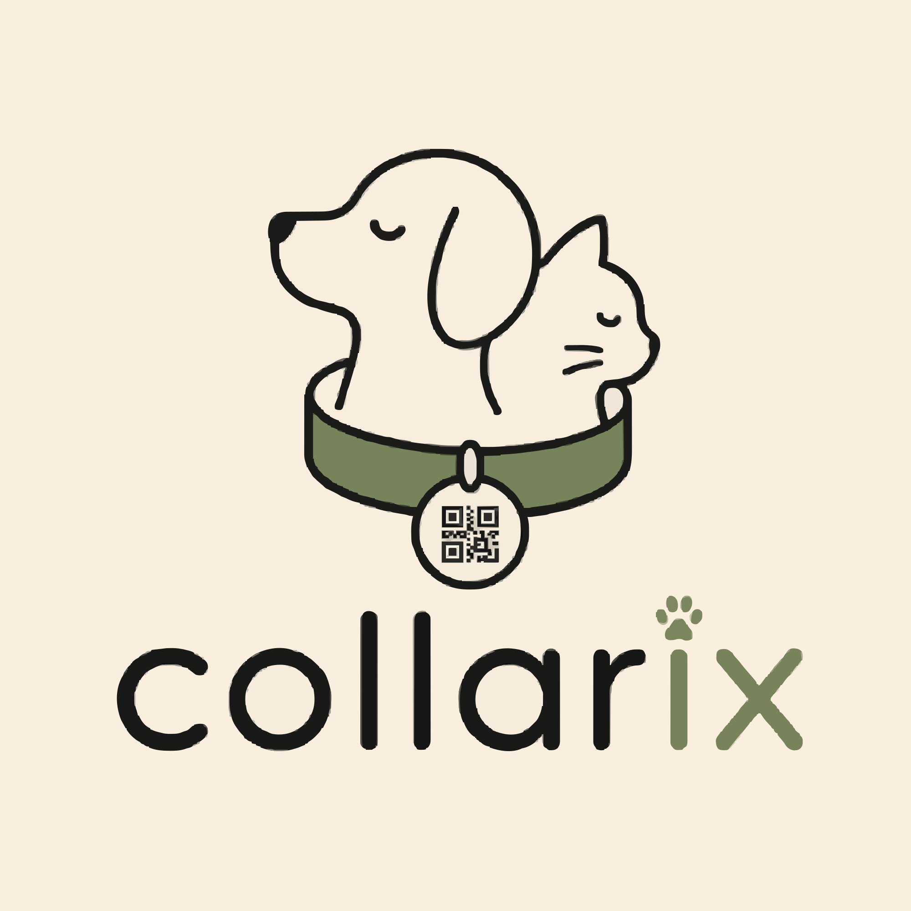

<div align="center">

<br />

<!-- LOGO / BANNER -->


<br /><br />

<h1>🐾 Collarix</h1>

<p><em>Smart Pet Care, beautifully designed.</em></p>

[](https://collarix.vercel.app)
[](https://react.dev)
[](https://supabase.com)
[](#)
[](https://vercel.com)

<br />

> **Collarix** is a full-stack progressive web app for pet owners to manage their companions' health, nutrition, vaccinations, vet visits, and digital ID tags — all in one beautifully crafted interface.

<br />

---

</div>

<br />

## 📋 Table of Contents

- [✨ Features Overview](#-features-overview)
- [📱 Screens & Functionality](#-screens--functionality)
- [🎨 Design System](#-design-system)
- [🔧 Tech Stack](#-tech-stack)
- [🗄️ Database Schema](#️-database-schema)
- [🚀 Getting Started](#-getting-started)
- [📲 PWA Installation](#-pwa-installation)
- [🔮 Roadmap](#-roadmap)
- [👩‍💻 About](#-about)

<br />

---

## ✨ Features Overview

<div align="center">

| Category | Feature | Status |
|----------|---------|--------|
| 🐾 Pet Profiles | Multi-pet management with full health records | ✅ Live |
| 🍽️ Food Tracker | Daily meal logging with portions & notes | ✅ Live |
| 💧 Water Tracker | Hydration monitoring with daily goals | ✅ Live |
| 🚽 Litter Tracker | Litter status + cleaning history (cats) | ✅ Live |
| 🏥 Vet & Health | Appointments, vaccination records, medications | ✅ Live |
| 🔔 Reminders | Custom care reminders with toggle on/off | ✅ Live |
| 📱 QR Pet Tags | Generate, download & share digital ID tags | ✅ Live |
| 🔍 QR Scanner | Scan pet tags via device camera | ✅ Live |
| 📚 Blog / Insights | Expert pet care articles with categories | ✅ Live |
| 🌙 Dark Mode | Full system-wide dark theme | ✅ Live |
| 🔔 Push Notifications | Browser push with per-type preferences | ✅ Live |
| 🍪 Cookie Preferences | Granular consent management | ✅ Live |
| 📲 PWA Install | Add to home screen on iOS & Android | ✅ Live |
| ⭐ In-App Rating | Star rating with feedback submission | ✅ Live |

</div>

<br />

---

## 📱 Screens & Functionality

<br />

### 🏠 Dashboard

The home screen gives you an instant health snapshot across all your pets.

- **Live stats cards** — total pets, active alerts, reminders count, upcoming vet visits
- **⚠️ Attention alerts** — highlights pets with overdue vaccinations in a warm amber banner
- **Today's reminders** — shows all active reminders across every pet for the day
- **Upcoming vet visits** — a glanceable list of scheduled appointments
- **🐾 Pet QR Tags box** — horizontally scrollable live QR codes for every pet, tap any to open its full tag page
- **Quick-access pet row** — tap any pet avatar to jump straight to their profile

<br />

### 🐾 My Pets

Your complete companion registry.

- **Multi-species support** — dogs 🐕 and cats 🐱 with species-appropriate tracking
- **Rich profiles** — name, breed, age, DOB, weight, height, sex, custom emoji & colour
- **Search & filter** — real-time search by name, filter by species
- **Health alert badges** — overdue vaccination warnings surface right on the pet card
- **Add pet flow** — full onboarding: pet details → owner info → emergency contact, all in one sheet

<br />

### 👤 Pet Profile

A complete single-pet health dashboard.

- **Vital stats grid** — weight, height, and date of birth at a glance
- **Find My Pet button** — deep links to Apple Find My (iOS) or Google Find My Device (Android)
- **Quick navigation grid** — one tap to Food, Water, Litter, Vet, Reminders, or Health from the profile
- **Vaccination records** — full list with status badges (`Up to date` / `Due soon` / `Overdue`)
- **Allergies & medications** — visually distinct pill tags and dose schedules
- **Owner & emergency contact** — all contact info including relation type, highlighted separately

<br />

### 🍽️ Food Tracker

Log every meal with precision.

- **Per-meal logging** — Breakfast, Lunch, Dinner, or Snack with time, food item, quantity, and notes
- **Today's view** — all meals for the current day shown in a clean timeline
- **Quick delete** — swipe-style trash icon on each entry
- **Date-scoped** — each log is tied to today's date, keeping history clean

<br />

### 💧 Water Tracker

Keep your pet hydrated.

- **Session logging** — log each drinking session with time and amount in ml
- **Progress bar** — visual daily hydration goal (800ml for dogs, 250ml for cats) with colour change on completion ✅
- **Quick-add buttons** — one-tap preset amounts: 100 / 150 / 200 / 300 / 400ml
- **Session count** — see total ml and number of sessions at a glance

<br />

### 🚽 Litter Tracker *(cats only)*

Never forget a litter clean again.

- **Live status** — Clean ✓ or Needs Cleaning ⚠️ with colour-coded indicator
- **One-tap mark clean** — logs timestamp and updates status instantly
- **Cleaning history** — full chronological list of past clean times
- **Dog-aware** — shows a friendly message for dogs redirecting to walk reminders

<br />

### 🏥 Vet & Health

Your pet's complete medical record.

- **Appointment scheduling** — date, vet name, clinic, reason, notes
- **Mark as past visit** — move upcoming appointments to the visit history with one tap
- **Vaccination table** — name, date given, next due date, status badge per vaccine
- **Past visits log** — full history with notes preserved
- **Overdue alerts** — vaccination status warnings propagate up to the dashboard

<br />

### 🔔 Reminders

Custom care reminders for every routine.

- **8 reminder types** — Feeding, Water, Litter, Medication, Vaccination, Vet, Grooming, Custom
- **Time scheduling** — set a specific time for each reminder
- **Toggle on/off** — enable or disable any reminder without deleting it
- **Colour-coded icons** — each reminder type has its own distinct colour and icon
- **Per-pet** — reminders are scoped to individual pets; dashboard aggregates them all

<br />

### 📱 QR Pet Tags

Digital ID tags your pet always carries.

- **Styled QR generation** — custom rounded-dot QR codes with Collarix brand colours
- **Live pet data** — encodes a unique pet profile URL (`collarix.vercel.app/pet/:id`)
- **Download** — saves as a high-res PNG directly to your device
- **Share** — uses native device share sheet (or clipboard fallback)
- **Inline editing** — update pet info directly from the QR page without going back
- **Dashboard QR box** — see all pets' QR codes at once on the home screen

<br />

### 🔍 QR Scanner

Scan any Collarix tag in seconds.

- **Native camera access** — opens device camera via `capture="environment"` — no extra apps needed
- **Your pet list** — all your pets listed below as quick-access shortcuts
- **Found pet flow** — captured image previewed with prompt to select matching pet profile

<br />

### 📚 Pet Insights (Blog)

Expert-curated pet care content.

- **Category filters** — All, Nutrition, Health, Training, Grooming, Behaviour
- **Live search** — filter articles by title or summary in real time
- **Full article view** — cover image, author, date, read time, and full article body
- **Supabase-powered** — articles managed via backend CMS, no redeploy needed

<br />

### ⚙️ Settings

Full control over your account and experience.

| Section | Options |
|---------|---------|
| 🎨 Appearance | Dark / Light mode toggle |
| 🔔 Notifications | Enable browser push, 6 per-type toggles, test notification |
| 🐾 Pets | Overview and health summary |
| 🍪 Cookie Preferences | Functional (always on) / Analytics / Marketing toggles |
| 🔒 Privacy Policy | Full in-app policy — no external link needed |
| 📋 Terms of Service | Full in-app ToS |
| ⭐ Rate Collarix | 5-star rating with feedback, saved to database |
| 📧 Contact Support | Opens email client directly |
| 📸 Instagram | Links to @collarix.in |
| 🚪 Sign Out | Clean session termination |
| ⚠️ Delete Account | Double-confirm destructive action, purges all data |

<br />

---

## 🎨 Design System

Collarix uses a hand-crafted **forest-green natural palette** built around calm, earthy tones that feel right at home in a pet care context.

<br />

<div align="center">

| Token | Light | Dark | Usage |
|-------|-------|------|-------|
| `bg` | `#F7F5F0` | `#101410` | Page background |
| `card` | `#FFFFFF` | `#181E16` | Cards, sheets, nav |
| `text` | `#2C3520` | `#D8E4D4` | Primary text |
| `textSub` | `#7A8B6A` | `#6A9062` | Subtitles, labels |
| `accent` | `#4A6741` | `#4A6741` | Buttons, active states |
| `border` | `#F0F4EC` | `#1F2B1C` | Dividers, card edges |

</div>

<br />

**Typography** — Georgia serif for headings, system sans-serif for body. Keeps it editorial and trustworthy without custom font loading.

**Dark mode** — implemented via React `ThemeContext` so every component — cards, inputs, modals, bottom nav, bottom sheets, badges — reads from the same theme object. No hardcoded colours anywhere in the component tree.

<br />

---

## 🔧 Tech Stack

<div align="center">

| Layer | Technology |
|-------|-----------|
| **Frontend** | React 18 (hooks, context) |
| **Styling** | Inline styles with dynamic theming |
| **Backend / DB** | Supabase (PostgreSQL + Auth) |
| **QR Codes** | `qr-code-styling` |
| **Icons** | `lucide-react` |
| **Hosting** | Vercel |
| **PWA** | Web App Manifest + `beforeinstallprompt` |
| **Camera** | HTML `capture="environment"` API |
| **Push** | Web Notifications API |
| **Storage** | `localStorage` for preferences |

</div>

<br />

---

## 🗄️ Database Schema

Collarix uses a **Supabase PostgreSQL** database with row-level security. Core tables:

```
pets               — profiles, health, owner/emergency info, litter status
food_logs          — date-scoped meal entries per pet
water_logs         — date-scoped hydration sessions per pet
litter_history     — timestamped cleaning log per pet
vet_appointments   — upcoming + past visits with is_past flag
reminders          — typed, timed, toggleable reminders per pet
blog_posts         — CMS-managed articles with category + cover image
app_ratings        — star ratings + feedback from users
```

All tables include `user_id` for row-level security — users can only read and write their own data.

<br />

---

## 🚀 Getting Started

```bash
# 1. Clone the repo
git clone https://github.com/your-username/collarix.git
cd collarix

# 2. Install dependencies
npm install

# 3. Set up environment variables
cp .env.example .env.local
# Add your Supabase URL and anon key:
# VITE_SUPABASE_URL=https://your-project.supabase.co
# VITE_SUPABASE_ANON_KEY=your-anon-key

# 4. Start the dev server
npm run dev
```

<br />

Then open [http://localhost:5173](http://localhost:5173) and create an account to get started.

> **Note:** You'll need a Supabase project with the schema above. Contact [collarix.in@gmail.com](mailto:collarix.in@gmail.com) for the full SQL migration file.

<br />

---

## 📲 PWA Installation

Collarix is a **Progressive Web App** — no app store needed.

<br />

**Android (Chrome)**
> A banner will appear after a few seconds → tap **Install** → it appears on your home screen like a native app.

<br />

**iOS (Safari)**
> Tap the **Share** button → scroll down → **Add to Home Screen** → tap **Add**.
> An in-app guide walks you through this automatically.

<br />

Once installed, Collarix runs full-screen with no browser chrome, just like a native app.

<br />

---

## 🔮 Roadmap

Things that would take Collarix to the next level:

- [ ] **NFC collar tags** — tap phone to collar, instant pet profile
- [ ] **Lost pet broadcast** — alert nearby Collarix users when a pet goes missing
- [ ] **Weight & growth charts** — trend lines over time with vet-ready PDF export
- [ ] **Multi-user households** — share pet management with family members
- [ ] **Firebase push notifications** — true background reminders even when app is closed
- [ ] **Vet finder map** — nearby clinics with ratings and direct booking
- [ ] **React Native / Capacitor** — true Play Store & App Store releases
- [ ] **Premium tier** — unlimited pets, PDF health exports, physical NFC tags shipped to you

<br />

---

## 👩‍💻 About

<div align="center">

<br />

**Collarix** was designed and developed by **Astitva Bhardwaj**

*Built for client **Saloni Agarwal** — smart pet care for modern pet parents.*

<br />

[](https://instagram.com/collarix.in)
[](mailto:collarix.in@gmail.com)
[](https://collarix.vercel.app)

<br />

---

<sub>Made with 🐾 and a lot of love for pets everywhere.</sub>

<br />

</div>
